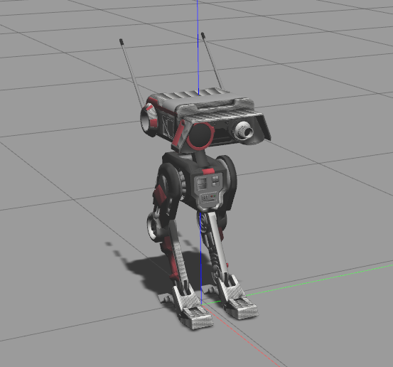

# BD1
ROS-based BD-1 droid from [Star Wars: The Fallen Order](https://en.wikipedia.org/wiki/Star_Wars_Jedi:_Fallen_Order) game.



# Goal of project
Make a real BD1 robot, that could walk in the real world envinroment.

# Tasks roadmap
[![](https://mermaid.ink/img/eyJjb2RlIjoiZmxvd2NoYXJ0IFREICAgICAgXG4gICAgY2xhc3NEZWYgZG9uZSBmaWxsOiNmZmYsc3Ryb2tlLXdpZHRoOjIsc3Ryb2tlOiMwMDAgICAgXG4gICAgY2xhc3NEZWYgd2lwIGZpbGw6I2Y1NSxjb2xvcjojZmZmLHN0cm9rZS13aWR0aDowXG4gICAgY2xhc3NEZWYgdGFzayBmaWxsOiM4ODgsY29sb3I6IzExMSxzdHJva2Utd2lkdGg6MFxuICAgIGNsYXNzRGVmIGVudHJ5IGZpbGw6IzAwMCxjb2xvcjojZmZmLHN0cm9rZS13aWR0aDowXG4gICAgc3ViZ3JhcGggbGVnZW5kIFtMRUdFTkRdXG4gICAgQShUQVNLKTo6OnRhc2tcbiAgICBBIC0tPiBCKFdJUCk6Ojp3aXBcbiAgICBCIC0tPiBDKERPTkUpOjo6ZG9uZVxuICAgIGVuZFxuICAgIEVOVFJZKChTVEFSVCBIRVJFKSk6OjplbnRyeSAtLT4gU0EgICAgXG4gICAgc3ViZ3JhcGggc2ltIFtTSU1VTEFUSU9OIFBBUlRdXG4gICAgU0EoR2F6ZWJvIGNvdHJvbGxhYmxlIG1vZGVsIG9mIGRyb2lkKTo6OmRvbmUgICBcbiAgICBTQSAtLT4gU0FlKEluZGVwZW5kZWQgSGVhZCBjb250cm9sbGVyKTo6OnRhc2sgIFxuICAgIFNBZSAtLS0-IFNEMTRcbiAgICBTQSAtLT4gU0FjKE1hbnVhbCB2ZWxvY2l0eSBjb250cm9sbGVyKTo6OmRvbmUgICBcbiAgICBTQSAtLT4gU0FhKERlcGxveSBHYXplYm8gRmFsbCBEZXRlY3Rvcik6Ojpkb25lXG4gICAgU0EgLS0-IFNBYihPYnRhaW4gcm9kb3QncyBjZW50ZXIgbWFzcyk6Ojpkb25lXG4gICAgU0FiIC0tPiBTQWQoT2J0YWluIGNlbnRlciBvZiBwcmVzc3VyZSk6Ojp3aXBcbiAgICBTQWQgLS0-IFNCXG4gICAgU0EgLS0-IFNDKFByb3ZpZGUgZ3ltLWxpa2UgZW52aXJvbm1lbnQgaW50ZXJmYWNlKTo6OmRvbmVcbiAgICBTQyAtLT4gU0IoQXR0YWNoIHNvbWUgUkwgbGlicmFyeSk6Ojpkb25lICAgXG4gICAgU0IgLS0-fGFsdGVybmF0aXZlbHl8IFNNKFVzZSBFbmQtMi1FbmQgYXBwcm9hY2ggYW5kIHRlYWNoIHJvYm90IHRvIHdhbGsgd2l0aCBkZXNpcmVkIHZlbG9jaXR5KTo6OnRhc2tcbiAgICBTTSAtLT4gU0dcbiAgICBTQWEgLS0-IFNCXG4gICAgU0IgLS0-IFNCMShUZWFjaCByb2JvdCBkbyBiYXNpYyBtb3ZlbWVudHMpOjo6d2lwIFxuICAgIFNCMSAtLT4gU0QoU3RhbmR1cCBmcm9tIGNvbnNlYWwgYW5kIGJhbGFuY2UpOjo6d2lwXG4gICAgU0QgLS0-IFNEMShTeW5jaHJvbml6ZWQgbGVncyk6Ojp3aXBcbiAgICBTRDEgLS0-IFNEMTIoU3RhdGljIGhlYWQpOjo6ZG9uZVxuICAgIFNEMSAtLT4gU0QxMyhGcmVlIGhlYWQpOjo6dGFza1xuICAgIFNEMSAtLT4gU0QxNChXaXRoIGhlYWQgY29udHJvbGxlZCBuZGVwZW5kZXRseSk6Ojp0YXNrXG4gICAgU0QgLS0-IFNEMyhJbmRlcGVuZGVkIGxlZ3MpOjo6d2lwXG4gICAgU0IxIC0tPiBTRShXYWxrKTo6OnRhc2tcbiAgICBTRSAtLT4gU0UxKFN0cmFpZ3QpOjo6dGFza1xuICAgIFNFIC0tPiBTRTIoUm90YXRlIG9uIGEgcGxhY2UpOjo6dGFza1xuICAgIFNCMSAtLT4gU0koRnJvbSBmYWxsZW4gdG8gY29uc2VhbCk6Ojp0YXNrXG4gICAgU0YoQ29udHJvbCBub2RlIHdpdGggbGVhcm5lZCBhY3Rpb25zIHN3aXRjaCk6Ojp0YXNrXG4gICAgU0IxID09PT0-IFNGXG4gICAgU0YgLS0-IFNHKERlcGxveSBwYXRoIHBsYW5uZXIgd2l0aCBlbXVsYXRlZCBsb2NhbGl6YXRpb24pOjo6dGFza1xuICAgIFNHLS0-U0soQWRkIHN0ZXJlbyBjYW0gb2JzdGFjbGVzIGRldGVjdG9yKTo6OnRhc2tcbiAgICBTSyAtLT4gU04oRGVwbG95IHN0ZXJlbyBTTEFNKTo6OnRhc2tcbiAgICBTTiAtLT4gRklMTEVSKC4uLik6Ojp0YXNrXG4gICAgRklMTEVSIC0tPiBFTkRTSU0oKFNJTSBQQVJUIERPTkUpKTo6OmVudHJ5XG4gICAgZW5kXG4gICAgRU5EU0lNIC0tPiBSQVxuICAgIHN1YmdyYXBoIHJlYWwgW1JFQUwgUEFSVF1cbiAgICBSQShDb25zdHJ1Y3QgcmVhbCBkcm9pZCk6Ojp0YXNrXG4gICAgUkEgLS0-IFJCKFVwZGF0ZSBHYXplYm8gbW9kZWwgd2l0aCBjb3JyZXNwb25kYW5jZSB0byByZWFsKTo6OnRhc2tcbiAgICAlJVJCIC0uLT4gU0FcbiAgICBSQiAtLT4gUkQoUmV0ZWFjaCBhbGwgbGVhcm5hYmxlIHBhcnRzIG9uIHVwZGF0ZWQgR2F6ZWJvIG1vZGVsKTo6OnRhc2sgXG4gICAgUkIgLS0-IFJFKFRyYWluIG9uIG1vZGVsIGZhbGwgZGV0ZWN0b3IgYnkgSU1VKTo6OnRhc2tcbiAgICBSRihUcmFuc21pdCBsZWFybmluZyBmcm9tIG1vZGVsIG9uIHJlYWwgZHJvaWQpOjo6dGFza1xuICAgIFJEIC0tPiBSRlxuICAgIFJFIC0tPiBSRlxuICAgIGVuZCAiLCJtZXJtYWlkIjp7fSwidXBkYXRlRWRpdG9yIjpmYWxzZX0)](https://mermaid-js.github.io/mermaid-live-editor/#/edit/eyJjb2RlIjoiZmxvd2NoYXJ0IFREICAgICAgXG4gICAgY2xhc3NEZWYgZG9uZSBmaWxsOiNmZmYsc3Ryb2tlLXdpZHRoOjIsc3Ryb2tlOiMwMDAgICAgXG4gICAgY2xhc3NEZWYgd2lwIGZpbGw6I2Y1NSxjb2xvcjojZmZmLHN0cm9rZS13aWR0aDowXG4gICAgY2xhc3NEZWYgdGFzayBmaWxsOiM4ODgsY29sb3I6IzExMSxzdHJva2Utd2lkdGg6MFxuICAgIGNsYXNzRGVmIGVudHJ5IGZpbGw6IzAwMCxjb2xvcjojZmZmLHN0cm9rZS13aWR0aDowXG4gICAgc3ViZ3JhcGggbGVnZW5kIFtMRUdFTkRdXG4gICAgQShUQVNLKTo6OnRhc2tcbiAgICBBIC0tPiBCKFdJUCk6Ojp3aXBcbiAgICBCIC0tPiBDKERPTkUpOjo6ZG9uZVxuICAgIGVuZFxuICAgIEVOVFJZKChTVEFSVCBIRVJFKSk6OjplbnRyeSAtLT4gU0EgICAgXG4gICAgc3ViZ3JhcGggc2ltIFtTSU1VTEFUSU9OIFBBUlRdXG4gICAgU0EoR2F6ZWJvIGNvdHJvbGxhYmxlIG1vZGVsIG9mIGRyb2lkKTo6OmRvbmUgICBcbiAgICBTQSAtLT4gU0FlKEluZGVwZW5kZWQgSGVhZCBjb250cm9sbGVyKTo6OnRhc2sgIFxuICAgIFNBZSAtLS0-IFNEMTRcbiAgICBTQSAtLT4gU0FjKE1hbnVhbCB2ZWxvY2l0eSBjb250cm9sbGVyKTo6OmRvbmUgICBcbiAgICBTQSAtLT4gU0FhKERlcGxveSBHYXplYm8gRmFsbCBEZXRlY3Rvcik6Ojpkb25lXG4gICAgU0EgLS0-IFNBYihPYnRhaW4gcm9kb3QncyBjZW50ZXIgbWFzcyk6Ojpkb25lXG4gICAgU0FiIC0tPiBTQWQoT2J0YWluIGNlbnRlciBvZiBwcmVzc3VyZSk6Ojp3aXBcbiAgICBTQWQgLS0-IFNCXG4gICAgU0EgLS0-IFNDKFByb3ZpZGUgZ3ltLWxpa2UgZW52aXJvbm1lbnQgaW50ZXJmYWNlKTo6OmRvbmVcbiAgICBTQyAtLT4gU0IoQXR0YWNoIHNvbWUgUkwgbGlicmFyeSk6Ojpkb25lICAgXG4gICAgU0IgLS0-fGFsdGVybmF0aXZlbHl8IFNNKFVzZSBFbmQtMi1FbmQgYXBwcm9hY2ggYW5kIHRlYWNoIHJvYm90IHRvIHdhbGsgd2l0aCBkZXNpcmVkIHZlbG9jaXR5KTo6OnRhc2tcbiAgICBTTSAtLT4gU0dcbiAgICBTQWEgLS0-IFNCXG4gICAgU0IgLS0-IFNCMShUZWFjaCByb2JvdCBkbyBiYXNpYyBtb3ZlbWVudHMpOjo6d2lwIFxuICAgIFNCMSAtLT4gU0QoU3RhbmR1cCBmcm9tIGNvbnNlYWwgYW5kIGJhbGFuY2UpOjo6d2lwXG4gICAgU0QgLS0-IFNEMShTeW5jaHJvbml6ZWQgbGVncyk6Ojp3aXBcbiAgICBTRDEgLS0-IFNEMTIoU3RhdGljIGhlYWQpOjo6ZG9uZVxuICAgIFNEMSAtLT4gU0QxMyhGcmVlIGhlYWQpOjo6dGFza1xuICAgIFNEMSAtLT4gU0QxNChXaXRoIGhlYWQgY29udHJvbGxlZCBuZGVwZW5kZXRseSk6Ojp0YXNrXG4gICAgU0QgLS0-IFNEMyhJbmRlcGVuZGVkIGxlZ3MpOjo6d2lwXG4gICAgU0IxIC0tPiBTRShXYWxrKTo6OnRhc2tcbiAgICBTRSAtLT4gU0UxKFN0cmFpZ3QpOjo6dGFza1xuICAgIFNFIC0tPiBTRTIoUm90YXRlIG9uIGEgcGxhY2UpOjo6dGFza1xuICAgIFNCMSAtLT4gU0koRnJvbSBmYWxsZW4gdG8gY29uc2VhbCk6Ojp0YXNrXG4gICAgU0YoQ29udHJvbCBub2RlIHdpdGggbGVhcm5lZCBhY3Rpb25zIHN3aXRjaCk6Ojp0YXNrXG4gICAgU0IxID09PT0-IFNGXG4gICAgU0YgLS0-IFNHKERlcGxveSBwYXRoIHBsYW5uZXIgd2l0aCBlbXVsYXRlZCBsb2NhbGl6YXRpb24pOjo6dGFza1xuICAgIFNHLS0-U0soQWRkIHN0ZXJlbyBjYW0gb2JzdGFjbGVzIGRldGVjdG9yKTo6OnRhc2tcbiAgICBTSyAtLT4gU04oRGVwbG95IHN0ZXJlbyBTTEFNKTo6OnRhc2tcbiAgICBTTiAtLT4gRklMTEVSKC4uLik6Ojp0YXNrXG4gICAgRklMTEVSIC0tPiBFTkRTSU0oKFNJTSBQQVJUIERPTkUpKTo6OmVudHJ5XG4gICAgZW5kXG4gICAgRU5EU0lNIC0tPiBSQVxuICAgIHN1YmdyYXBoIHJlYWwgW1JFQUwgUEFSVF1cbiAgICBSQShDb25zdHJ1Y3QgcmVhbCBkcm9pZCk6Ojp0YXNrXG4gICAgUkEgLS0-IFJCKFVwZGF0ZSBHYXplYm8gbW9kZWwgd2l0aCBjb3JyZXNwb25kYW5jZSB0byByZWFsKTo6OnRhc2tcbiAgICAlJVJCIC0uLT4gU0FcbiAgICBSQiAtLT4gUkQoUmV0ZWFjaCBhbGwgbGVhcm5hYmxlIHBhcnRzIG9uIHVwZGF0ZWQgR2F6ZWJvIG1vZGVsKTo6OnRhc2sgXG4gICAgUkIgLS0-IFJFKFRyYWluIG9uIG1vZGVsIGZhbGwgZGV0ZWN0b3IgYnkgSU1VKTo6OnRhc2tcbiAgICBSRihUcmFuc21pdCBsZWFybmluZyBmcm9tIG1vZGVsIG9uIHJlYWwgZHJvaWQpOjo6dGFza1xuICAgIFJEIC0tPiBSRlxuICAgIFJFIC0tPiBSRlxuICAgIGVuZCAiLCJtZXJtYWlkIjp7fSwidXBkYXRlRWRpdG9yIjpmYWxzZX0)

# How to install
1. Install [ROS Noetic](http://wiki.ros.org/noetic/Installation/Ubuntu)
2. Install additional ROS packages
```bash
sudo apt install ros-noetic-velocity-controllers
```
3. If you want to use GPU, install CUDA and cuDNN, [here is guide](https://medium.com/analytics-vidhya/installing-tensorflow-with-cuda-cudnn-gpu-support-on-ubuntu-20-04-f6f67745750a) _need to be followed until 'Finally to verify the correct installation'_
4. Install [pytorch](https://pytorch.org/)
5. Install [stable-baselines3](https://github.com/DLR-RM/stable-baselines3)

# Repository structure
 - 
